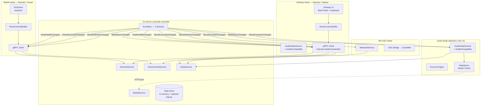
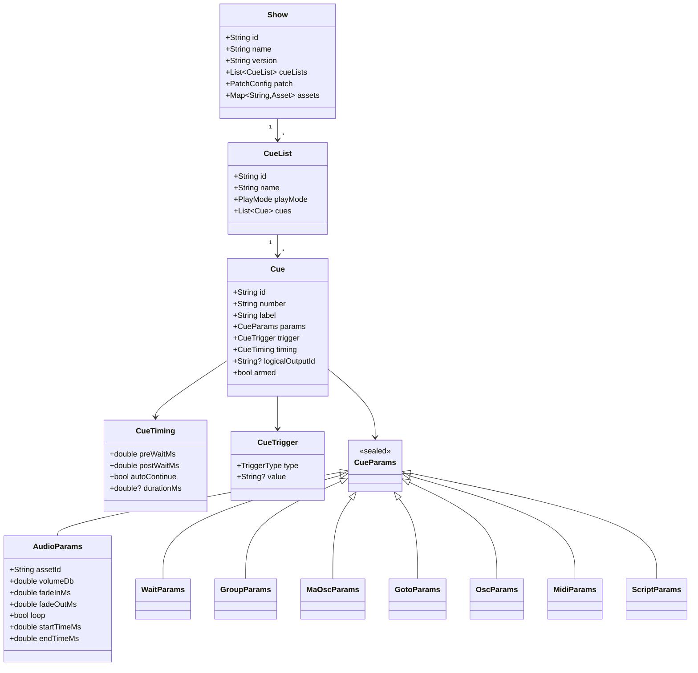
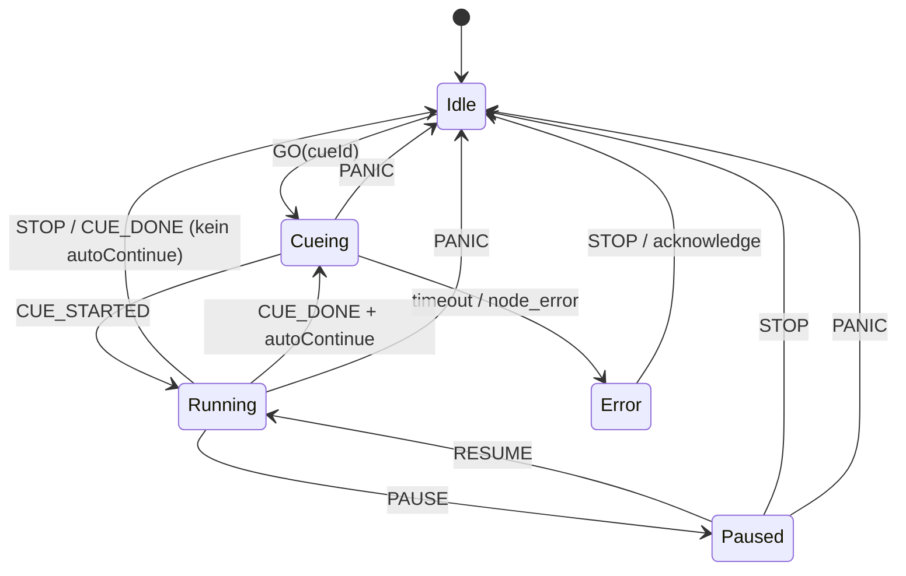
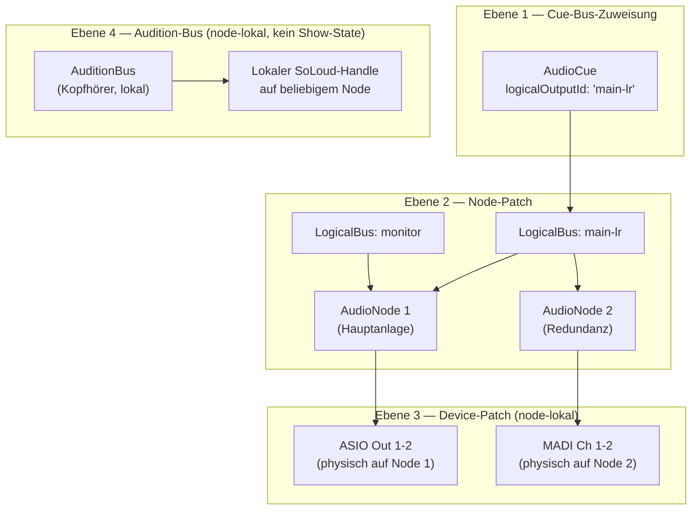

# Plan: StageSync Show-Control — Technisches Zielbild & Refactoring-Roadmap

> **Revision 4** — Master-Architektur geschärft: Go-Server ist einzige Autorität (kein Flutter-Master), Rollen-basierte Transport-Rechte auf Server-Seite, Remote-Node-Management via `NodeConfigCommand`, optionaler `--audio-node`-Modus für Einzelplatz-Setups.

Der bestehende Prototyp hat eine solide technische Basis (gRPC, ClockSync, AudioNode mit Prioritäts-Queue, MediaSync mit SHA-256, GoScreen). Der Plan baut konsequent darauf auf — er ersetzt nichts grundlos, sondern schärft Domain-Modell, UI-Konzept, Audio-Routing, Medien-Management und Desktop-Architektur.

---

## 1. Zielarchitektur



### Rollen

| Komponente | Autorität | Kann schreiben | Nur lesen |
|---|---|---|---|
| **Go-Server** | Alleinige Autoritätsinstanz | Alle Zustandsänderungen | — |
| **Master-Node** | Erstellt Session, sendet Commands | GO/STOP/PAUSE, CueList-Edit, Patch-Config | — |
| **Operator-UI** | Editor-Rolle (NODE_TASK_EDITOR) | CueList, Patch, Media-Upload | — |
| **Audio-Node** | Führt Commands aus | Lokal: SoLoud-State, Audition-Bus | Server-Commands |
| **MA-OSC-Node** | Führt Commands aus | Lokal: OSC | Server-Commands |
| **Mobile Remote** | Viewer/Operator Light | GO/PAUSE/STOP/RESUME | Session, CueList |

**Designentscheidung**: Der Go-Server ist fester Master, kein Leader-Election. Im Theaterkontext braucht man klare Autorität, keine verteilten Schreibkonflikte. Der Go-Server hält den autoritativen Show-State in-memory; Geräte sind nur Empfänger und Ausführende.

**gRPC Channel-Nutzung**: Der `ClientChannel` und alle Stubs werden für die gesamte Session-Laufzeit wiederverwendet. Fachliche Streams (Definition, Execution, Health, Media) werden als langlebige gRPC Server-Streams aufgebaut. Bei Streamfehlern wird **der Stream neu aufgebaut, nicht der gesamte Channel** — der Stub bleibt erhalten, nur die `ResponseStream`-Subscription wird gecancelt und neu gestartet.

---

## 2. Fachliches Domänenmodell

### Hierarchie



**Wichtig**: `AudioParams` referenziert `assetId` (SHA256-basiert), nicht mehr einen Dateipfad-String. `logicalOutputId` auf `Cue`-Ebene verweist auf einen benannten logischen Bus in der `PatchConfig` (nicht auf einen Node direkt — Stabilität bei Node-Wechsel). Die Benennung `logicalOutputId` statt `outputBusId` macht die fachliche Bedeutung klarer: es ist ein logischer Ausgang, kein internes Bus-Konzept.

### Dart: Immutable Domain-Modell (Flutter-seitig)

Die Proto-Typen bleiben das Transportformat. Flutter nutzt **eigene immutable Dart-Klassen** als Domain-Modell, die vom Proto konvertiert werden:

```
lib/showcontrol/domain/
  show.dart              // Show, CueList, Cue (immutable + copyWith)
  cue_params.dart        // sealed CueParams-Hierarchie
  cue_trigger.dart       // CueTrigger sealed
  playhead.dart          // PlayheadState, CueRunState, NodeExecState
  patch_config.dart      # 4-Ebenen-Modell (s. Abschnitt 13)
  asset.dart             # Asset + AudioMetadata + AssetReadiness
  node_status.dart       # NodeStatus, AuditionCapability
```

### Live-Ausführungszustand (Runtime, mutable)

```
PlayheadState {
  String cueListId
  String? activeCueId       // "laufende" Cue aus Sicht des Playheads
  Set<String> runningCueIds // alle gleichzeitig laufenden Cues (Group!)
  String? nextCueId
  CueListPhase phase        // idle | cueing | running | paused | panic
  int? startedServerMs
  int? pausedAtServerMs
  Map<String, CueRunState> perCue
}

CueRunState {
  CueLifecycle lifecycle   // armed | loading | running | paused | done | error
  Map<String, NodeExecState> nodes
  String? errorMessage
}

// Erweiterter NodeExecState — unterscheidet alle relevanten Zwischenzustände
NodeExecState {
  NodeExecPhase phase  // idle | awaiting_asset | preloading | buffering
                       //   | ready | playing | paused | done | degraded | error
  double? bufferPct    // für buffering-Fortschritt
  String? errorMessage
}
```

**Warum `awaiting_asset` und `buffering` getrennt?**  
`awaiting_asset` = MediaSync hat die Datei noch nicht; Node kann nicht preloaden.  
`buffering` = Datei ist lokal, SoLoud lädt in den RAM-Puffer; Playback bald bereit.  
`degraded` = Node läuft, aber mit eingeschränkter Qualität (z.B. Fallback-Device).  
Ohne diese Unterscheidung kann der Operator im Live-Betrieb nicht sinnvoll reagieren.

**Immutable**: `Show`, `CueList`, `Cue`, `CueParams`, `PatchConfig`, `Asset`  
**Runtime-dynamisch**: `PlayheadState`, `CueRunState`, `NodeExecState`, `NodeStatus`, `SessionState`

---

## 3. Realtime & Distributed Design

### Kanalstrategie (was über welchen Kanal)

| Kanal | Protokoll | Inhalt | Garantie |
|---|---|---|---|
| **Command-Channel** | gRPC Unary | GO, STOP, PAUSE, RESUME, UPSERT_CUE | At-most-once, bestätigt per Response |
| **Definition-Stream** | gRPC Server-Streaming (langlebig) | ShowDefinitionChanged | In-order per Session |
| **Execution-Stream** | gRPC Server-Streaming (langlebig) | ShowExecutionChanged | In-order per Session |
| **Health-Stream** | gRPC Server-Streaming (langlebig) | NodeHealthChanged | In-order per Session |
| **Media-Stream** | gRPC Server-Streaming (langlebig) | MediaSyncChanged | In-order per Session |
| **Node-Commands** | gRPC Server-Streaming (langlebig) | AudioPreload, AudioPlay, OscTrigger | In-order per Node |
| **Media API** | HTTP/1.1 | Upload, Download, SSE | HTTP-Standard |

**Begründung für 4 getrennte Streams statt einem monolithischen Event-Stream**: Definition und Execution sind fachlich unabhängig. Eine UI, die nur den Execution-State anzeigt (z.B. GoScreen), muss keine Definition-Events verarbeiten und umgekehrt. Außerdem macht es Recovery einfacher: nach Reconnect kann jeder Stream unabhängig einen Snapshot senden.

**gRPC über HTTP/2**: Channel und Stubs werden für die gesamte Session-Laufzeit gehalten. Bei Streamfehlern wird **nur der betroffene Stream** (die `ResponseStream`-Subscription) gecancelt und neu aufgebaut — der Channel bleibt stabil. Streams werden nicht kurzlebig pro Request erzeugt.

### Idempotenz & Ordering

- **Commands** erhalten eine `commandId` (UUID) → Server dedupliziert in-memory für 60 s
- **Events** haben eine monotone `seq` (pro Session, pro Stream) → Clients verwerfen veraltete
- **Snapshots**: Jeder Stream sendet beim Aufbau ein erstes Event vom Typ `*_SNAPSHOT` mit vollständigem State
- **Heartbeat** alle 5 s → Clock-Offset (NTP-artig, EMA-Glättung bereits implementiert)

### Reconnect-Strategie

```
Reconnect-Flow:
1. Heartbeat schlägt 3× fehl → health = disconnected
2. Exponentieller Backoff: 1s, 2s, 4s, 8s … max 30s
3. Bei Reconnect: alle 4 Streams neu aufbauen
4. Jeder Stream schickt Snapshot-Event → Client sofort synchron ohne
   manuelle State-Rekonstruktion
5. AudioNode: commandSub neu starten, läuft Preload nach wenn Cue aktiv
```

---

## 4. Datenstrukturen & Zustandsmodell

### Empfehlung: Hybrides Modell

**Nicht**: reines Event Sourcing (zu komplex, kein Audit-Zwang).  
**Nicht**: reines CRUD (verliert Event-Semantik, schlechter für Realtime-Sync).  
**Sondern**: **CQRS-Light mit Append-Only Command-Log**:

- **Write-Side (Server)**: Commands ausgeführt, State in-memory mutiert, Command in SQLite-Log persistiert
- **Read-Side (Clients)**: Streamen den State per 4 getrennten Event-Streams
- **Recovery**: Server lädt letzten Snapshot aus SQLite + replayed offene Commands

```
Go-Server: State Store
├─ in-memory:  map[sessionId]*SessionState
│              (ShowDefinition, Playhead, NodeRegistry, PatchConfig)
├─ SQLite:     sessions, cue_lists, cues, patch_config,
│              command_log, asset_manifests, snapshots
└─ Snapshot:   beim Shutdown / nach jeder Show-Definition-Änderung
```

### Cue Graph / Queue

```
CueList {
  id, name, playMode
  cues: []CueRow {
    cue: Cue
    orderIndex: int     // für ReorderableListView
    groupDepth: int     // Einrücktiefe für Group-Cues
  }
}

Playhead {
  cueListId
  activeCueIndex: int
  runningCues: map[cueId]RunHandle
}
```

---

## 5. Flutter-App-Architektur (Show-Control-Teil)

### Vorgeschlagene Ordnerstruktur

```
lib/showcontrol/
├── domain/
│   ├── show.dart
│   ├── cue_params.dart
│   ├── playhead.dart          # PlayheadState, CueRunState, NodeExecState
│   ├── patch_config.dart      # 4-Ebenen-Modell (s. Abschnitt 13)
│   ├── asset.dart             # Asset, AudioMetadata, AssetReadiness
│   └── node_status.dart       # NodeStatus, AuditionCapability
├── application/
│   ├── show_control_notifier.dart
│   ├── session_notifier.dart
│   ├── patch_notifier.dart
│   └── media_notifier.dart
├── infrastructure/
│   ├── grpc/
│   │   ├── stage_sync_client.dart         # Channel + Stubs (Singleton, langlebig)
│   │   ├── generated/
│   │   ├── show_control_repository.dart   # proto ↔ domain mapper
│   │   └── session_repository.dart
│   ├── db/
│   │   └── show_dao.dart
│   ├── media/
│   │   ├── media_sync.dart
│   │   └── server_media_client.dart
│   └── nodes/
│       ├── audio_node/
│       └── ma_node/
├── ui/
│   ├── design_system/
│   │   ├── sc_colors.dart
│   │   ├── sc_typography.dart
│   │   ├── sc_spacing.dart
│   │   ├── sc_theme.dart
│   │   ├── primitives/        # Generische SC-Primitive (keine Domain-Kenntnis)
│   │   │   ├── sc_button.dart
│   │   │   ├── sc_chip.dart
│   │   │   ├── sc_inline_field.dart
│   │   │   ├── sc_meter.dart
│   │   │   ├── sc_panel.dart
│   │   │   └── sc_split_view.dart
│   │   └── domain_components/  # Domänenspezifische Komponenten
│   │       ├── cue_list_row.dart
│   │       ├── transport_bar.dart
│   │       ├── node_status_badge.dart
│   │       ├── active_cue_monitor.dart
│   │       ├── patch_matrix.dart
│   │       ├── audio_cue_minibar.dart
│   │       └── level_meter.dart
│   ├── shell/
│   │   ├── sc_adaptive_shell.dart
│   │   ├── sc_shortcuts.dart   # Shortcut-/Action-Definitionen (Shell-Ebene)
│   │   ├── desktop_shell.dart
│   │   └── mobile_shell.dart
│   └── screens/
│       ├── go/
│       ├── editor/
│       ├── patch/
│       ├── media/
│       ├── monitoring/
│       └── session/
└── providers/
    ├── show_control_provider.dart
    ├── session_provider.dart
    └── audio_node_provider.dart
```

### Zwei UI-Schichten: Primitive und Domänenkomponenten

**Primitive SC-Komponenten** kennen keine Show-Control-Domain. Sie erhalten nur typsichere Basis-Parameter:

```dart
// PRIMITIV — keine Domain-Importe
ScButton(label: 'GO', color: ScColors.active, onPressed: onGo)
ScChip(label: 'AUDIO', state: ChipState.ok)
ScInlineField(label: 'Vol', value: '-6.0 dB', onChanged: onVolumeChanged)
ScMeter(level: 0.8, peak: 0.95)
ScPanel(title: 'Inspector', child: ...)
ScSplitView(left: cueList, right: inspector, dividerPosition: 0.3)
```

**Domänenkomponenten** kennen den Show-Control-Domain-Layer, aber keine gRPC/Proto-Typen:

```dart
// DOMÄNE — importiert aus domain/, nicht aus infrastructure/
CueListRow(cue: cue, state: CueRowState.active, onTap: ...)
TransportBar(playhead: playhead, onGo: ..., onStop: ..., onPause: ...)
NodeStatusBadge(node: nodeStatus)
PatchMatrix(config: patchConfig, onAssign: ...)
ActiveCueMonitor(cueRunState: cueRunState)
```

**Business-Logik bleibt in Notifiern/Repositories**: Widgets rufen `ref.read(provider.notifier).go()` — keine gRPC-Logik in Widgets.

### Adaptive Shell & Keyboard als First-Class-Feature

```dart
// sc_adaptive_shell.dart — Keyboard/Shortcuts auf Shell-Ebene, NICHT widgetweise
class ScAdaptiveShell extends ConsumerWidget {
  @override
  Widget build(context, ref) {
    final isDesktop = MediaQuery.sizeOf(context).width > 900;
    return Shortcuts(
      shortcuts: ScShortcuts.all,  // Space=GO, Esc=STOP, P=PAUSE, ↑↓=Navigate
      child: Actions(
        actions: ScShortcuts.actions(ref),
        child: Focus(
          autofocus: true,
          child: isDesktop ? const DesktopShell() : const MobileShell(),
        ),
      ),
    );
  }
}

// sc_shortcuts.dart
class ScShortcuts {
  static const all = {
    SingleActivator(LogicalKeyboardKey.space): GoIntent(),
    SingleActivator(LogicalKeyboardKey.escape): StopIntent(),
    SingleActivator(LogicalKeyboardKey.keyP): PauseIntent(),
    SingleActivator(LogicalKeyboardKey.arrowUp): PrevCueIntent(),
    SingleActivator(LogicalKeyboardKey.arrowDown): NextCueIntent(),
    SingleActivator(LogicalKeyboardKey.enter): SelectCueIntent(),
    SingleActivator(LogicalKeyboardKey.delete): DeleteCueIntent(),
  };

  static Map<Type, Action<Intent>> actions(WidgetRef ref) => {
    GoIntent: CallbackAction(onInvoke: (_) =>
        ref.read(showControlProvider.notifier).go()),
    StopIntent: CallbackAction(onInvoke: (_) =>
        ref.read(showControlProvider.notifier).stop()),
    PauseIntent: CallbackAction(onInvoke: (_) =>
        ref.read(showControlProvider.notifier).pause()),
    // ...
  };
}
```

**Mobile**: GoScreen bleibt Kern → schmales Layout, ein Panel (kein Keyboard)  
**Tablet**: GoScreen + kompaktes Status-Panel nebeneinander  
**Desktop**: Multi-Panel (CueList | Inspector | Monitoring) + vollständige Keyboard-Navigation

---

## 6. UX-Konzept Desktop vs. Mobile

### Desktop — Vollständige Arbeitsfläche

```
┌─────────────────────────────────────────────────────────────────────┐
│  [GO]  [STOP]  [PAUSE]  ▶ Szene A  0:23  ████░░ 45%  ● Connected  │  ← TransportBar
├──────────────┬───────────────────────────┬─────────────────────────┤
│  CueList     │  Inspector                │  Monitoring             │
│  (260px)     │  (flex)                   │  (260px)                │
│              │                           │                         │
│ #   Label  T │  ┌─ Audio ─────────────┐  │  ● AudioNode1  ▶1       │
│ 1   Intro  ♪ │  │ Asset: intro.wav    │  │    phase: playing       │
│▶2   Szene  ♪ │  │ Vol: -6 dB         │  │  ● MaNode1     MA●      │
│ 3   Licht  💡│  │ Fade: 0→2s / 3→0s  │  │                         │
│ 4   Warten ⏱ │  │ Bus:  Main L/R     │  │  Active: Szene A        │
│ 5   Goto1  ↩ │  │ [🔊 Vorhören]      │  │  ████░░░░ 45% / 0:23   │
│              │  └────────────────────┘  │                         │
│  [+ Cue]     │  [Speichern][Verwerfen]   │  Next: Licht            │
├──────────────┴───────────────────────────┴─────────────────────────┤
│  [Patch]  [Media]  │  Space=GO  Esc=STOP  P=PAUSE  ↑↓=Nav  Del=🗑  │
└─────────────────────────────────────────────────────────────────────┘
```

**Zwingend Desktop**: CueList-Editor, Inspector, Patch-Matrix, Media-Manager, Multi-Panel, Keyboard-Navigation (First-Class), Drag&Drop-Reorder, Kontextmenü, Audition-Button

### Mobile — Reduziert & Betriebssicher

```
┌─────────────────────┐
│ Session ● Audio●    │   ← Status-Strip
├─────────────────────┤
│  2/12 Cue  ████░    │   ← Progress
├─────────────────────┤
│  ▶ 2 Szene A  0:23  │   ← Aktive Cue (read-only)
│  • 3 Licht          │   ← Nächste
│  • 4 Warten  10s    │
├─────────────────────┤
│                     │
│    ██████ GO ██████ │   ← Großer GO-Button
│                     │
│  [⏸ PAUSE] [⏹ STOP] │   ← Sekundäre Controls
└─────────────────────┘
```

**Bewusst NICHT mobil**: CueList-Editing, Patch, Media-Upload, Inspector, Reorder, Audition. Mobile ist read-only Fahrplan + GO/PAUSE/STOP/RESUME.

---

## 7. Server-Struktur in Go

```
server/
├── cmd/
│   └── stagesync/main.go
├── internal/
│   ├── session/
│   │   ├── manager.go
│   │   ├── node_registry.go   # NodeRegistry mit AuditionCapability-Flag
│   │   └── clock.go
│   ├── showcontrol/
│   │   ├── engine.go          # ShowEngine: go/stop/pause/resume, Playhead
│   │   ├── cue_executor.go    # Cue-Ausführung: dispatch + Group-Executor
│   │   ├── event_bus.go       # 4 getrennte Broadcast-Kanäle
│   │   └── command_log.go
│   ├── node/
│   │   ├── command_router.go  # Routing über PatchConfig → Nodes
│   │   └── capability.go      # Capability: Audio, MA, Audition
│   ├── media/
│   │   ├── store.go           # Content-Addressable: SHA256 als Key
│   │   └── manifest.go        # Per-Show-Manifest
│   ├── patch/
│   │   └── patch_config.go    # 4-Ebenen: CueBus, NodePatch, DevicePatch, Audition
│   └── persistence/
│       ├── sqlite.go
│       └── snapshot.go
└── proto/
    └── stagesync/v1/
```

### Master-Konzept

Fester Master statt Leader-Election: Der Go-Server **ist** der Master. Geräte mit `NODE_ROLE_MASTER` oder `NODE_TASK_MASTER` haben Schreibrechte auf ShowControl-Commands; andere Nodes haben nur Lese-/Viewer-Rechte.

**In-Memory**: `ShowDefinition`, `Playhead`, `NodeRegistry`, `PatchConfig`, `EventStreams`  
**Persistiert**: `CueLists`, `Cues`, `PatchConfig`, `CommandLog`, `AssetManifest`, `Sessions` (wenn persistent)

---

## 8. Fehlerrobustheit

| Szenario | Strategie |
|---|---|
| **Netzwerkunterbrechung** | Heartbeat-Counter, 3 Fehlschläge → `disconnected`-Banner, Backoff |
| **Node-Rejoin** | Alle 4 Streams senden Snapshot → Client sofort synchron |
| **Doppelte Commands** | `commandId` (UUID) → Server dedupliziert in-memory 60 s |
| **Verspätete Events** | Seq-Nummer pro Stream → verwerfen wenn `seq < lastSeq` |
| **AudioNode: awaiting_asset** | UI zeigt `⏳ Datei wird geladen` im NodeExecState; Cue bleibt in loading-Phase |
| **AudioNode: degraded** | UI zeigt ⚠-Badge; Show läuft weiter, aber Operator wird informiert |
| **AudioNode-Ausfall** | Server markiert Node `offline` → `NodeHealthChanged`-Event → Warning-Badge |
| **Inkonsistenter State** | `PANIC`-Command → Server `stopAll` an alle Nodes, Playhead reset |
| **Partieller Node-Ausfall** | `NodeExecState.phase = error` pro Node sichtbar im `ActiveCueMonitor` |

### Fail-Safe

- **PANIC-Funktion**: Prioritäts-Queue auf AudioNode bereits implementiert; PANIC überspringt die Queue
- **Degradierter Betrieb**: Audio-Node degraded → MA-OSC/Wait/Goto laufen weiter
- **Operator-Feedback**: Rotes Badge + Phasen-Text; nie stilles Versagen

---

## 9. Schrittweiser Refactoring-Plan

### Phase 1 — Domain-Modell stabilisieren (2–3 Wochen)

**Ziel**: Saubere Dart-Domänenklassen, entkoppelt von Proto; sealed `CueParams`; erweiterter `NodeExecState`; `assetId` statt Pfad in `AudioParams`

**Wichtigste Änderungen**:
- `lib/showcontrol/domain/` anlegen
- `ShowControlRepository` als Mapper (Proto ↔ Domain)
- `PlayheadState` + erweiterter `NodeExecState` (awaiting_asset, preloading, buffering, degraded)
- `AudioParams.assetId` statt `filePath`
- `ShowControlNotifier` auf Domain-Typen umstellen

**Risiken**: UI-Referenzen auf Proto-Typen müssen migriert werden  
**Nächste Schritte**: `domain/show.dart`, `domain/cue_params.dart`, `domain/playhead.dart`, `infrastructure/grpc/show_control_repository.dart`

**Tests** (Flutter — `test/showcontrol/domain/`):
- `show_test.dart`: `Cue.copyWith`, sealed `CueParams` Pattern-Matching, `AudioParams.assetId`-Pflicht
- `playhead_test.dart`: `PlayheadState`-Transitionen (idle→running→paused), `NodeExecState`-Phasen
- `show_control_repository_test.dart`: Proto→Domain-Mapping für alle Cue-Typen; Roundtrip-Prüfung

---

### Phase 2 — Protokoll-Erweiterungen & Master-Architektur ✓ (laufend)

**Ziel**: `commandId` für Idempotenz; Rollen-basierte Transport-Rechte; Remote-Node-Management; `AuditionCapability`

**Abgeschlossen** ✓:
- `commandId` zu GoRequest/StopRequest/PauseRequest/ResumeRequest (UUID, Server dedupliziert 60s)
- `cue_started_at_ms` in `ShowStateEvent` (expliziter Clock-Anker)
- Bug-Fix: `Stop()` setzt active cue zurück, pausedAt korrekt getrackt
- Clock-Sync: `StartUnixMillis` = echter Server-Timestamp im AudioPlayCommand
- Go + Dart Stubs neu generiert

**Ausstehend**:
- Proto: `NodeConfigCommand` → Remote-Gerätekonfiguration durch Master
- Proto: `NodeCapabilities.audition_supported` Flag
- Go-Server: Rollenprüfung auf Transport-Commands (nur MASTER/EDITOR darf GO/STOP/PAUSE)
- Go-Server: `SendNodeCommand` nur für MASTER erlaubt
- Flutter: `AudioNodeService` handhabt `NodeConfigCommand`
- Flutter: `NodeManagementPanel` — Master sieht alle Nodes, kann Gerät remote setzen
- Optionaler `--audio-node` Modus am Go-Server (Einzelplatz-Convenience)

**Architektur-Klarstellung**:

```
"Master" hat zwei getrennte Bedeutungen — NICHT vermischen:

  Server-Autorität (immer Go-Server):
    → Einziger Schreiber des Show-State
    → Routet alle Befehle an Nodes
    → Kann nicht übernommen werden
    → Kein Flutter-Client braucht "Master"-Rechte für Playback

  Operator-Rechte (rollen-basiert, vom Server geprüft):
    → NODE_TASK_MASTER / NODE_TASK_EDITOR: darf GO/STOP/PAUSE und SendNodeCommand
    → NODE_TASK_VIEWER: nur lesen, kein Transport-Zugriff
    → Prüfung IMMER auf dem Server — Client kann das nicht umgehen
    → Master-UI zeigt Schreib-Buttons nur bei passender Rolle (UX, nicht Security)
```

**Remote Node Management** (Master kann remote):
- Audio-Ausgabegerät auf einem Node setzen (`NodeConfigCommand.audio_device_index`)
- Netzwerk-Interface setzen (`NodeConfigCommand.network_interface_address`)
- Test-Signal senden (bereits implementiert via `AudioTestSignalCommand`)
- Node-Capabilities einsehen (bereits via `WatchNodes` / `NodeEvent.TYPE_CAPS_UPDATED`)

**Server-Audio-Node** (`--audio-node` Flag) — für **professionelle Shared-Setups**:
- Go-Server startet internen AudioNode via `malgo` (Go-Bindings für miniaudio/CGO)
- **ASIO Pflicht**: miniaudio unterstützt ASIO (Windows), CoreAudio (macOS), ALSA (Linux) — kein proprietäres SDK nötig; auf Windows WASAPI Exclusive Mode als ASIO-äquivalente Alternative
- Direktzugriff auf MediaStore (kein HTTP/MediaSync nötig — Dateien liegen direkt auf dem Server)
- Registriert sich als `NODE_TASK_AUDIO_OUTPUT` im internen Dispatcher
- Software-Mixer: mehrere gleichzeitige Cues (Group-Cues) werden per Sample gemischt
- **Remote Device-Wechsel**: Master kann `NodeConfigCommand.audio_device_index` senden → Engine wechselt Ausgabegerät live ohne Neustart
- Device-Enumeration: Server gibt verfügbare Geräte via `NodeCapabilities.audio_devices` zurück
- Server-Timestamp-Synchronisation: PLAY-Command enthält `start_unix_millis` → Engine berechnet Sample-Offset für frame-genauen Einsatz
- **Typischer Einsatz**: Shared-Setup auf einem dedizierten Audio-Rechner im Netzwerk (kein separater Flutter-Client nötig); professionelle Theater-Installation mit festem ASIO-Interface

**Risiken**: Rollenprüfung erfordert Token→NodeTask-Lookup in jedem Handler  
**Nächste Schritte**: `NodeConfigCommand` ins Proto, Rollenprüfung in `showcontrol_handler.go`, Flutter-Handler

**Tests** (Go — `internal/grpc/`):
- `showcontrol_handler_test.go`: GO/STOP/PAUSE mit VIEWER-Token → Expect `PERMISSION_DENIED`; mit MASTER-Token → `OK`
- `commandid_dedup_test.go`: gleiche `commandId` zweimal senden → zweite Response ohne State-Mutation
- `node_handler_test.go`: `SendNodeCommand` mit falschem Token → abgelehnt

**Tests** (Flutter — `test/showcontrol/providers/`):
- `show_control_notifier_test.go`: `go()` delegiert an Repository, propagiert Domain-State korrekt
- Mock-Repository via mocktail; `ProviderContainer` für Isolation

---

### Phase 3 — Desktop-UI & Design-System (3–4 Wochen)

**Ziel**: Design-System mit Primitiv- und Domänen-Schicht; `ScAdaptiveShell`; Keyboard als First-Class-Feature; `TransportBar`

**Wichtigste Änderungen**:
- `design_system/primitives/`: `ScButton`, `ScChip`, `ScInlineField`, `ScMeter`, `ScPanel`, `ScSplitView`
- `design_system/domain_components/`: `CueListRow`, `TransportBar`, `NodeStatusBadge`, `ActiveCueMonitor`
- `sc_shortcuts.dart` auf Shell-Ebene: `Space=GO`, `Esc=STOP`, `P=PAUSE`, `↑↓=Nav`, `Enter=Select`, `Del=Delete`
- `DesktopShell` mit drei Panels + Tab-Bar (Patch / Media)
- `CueInspectorPanel` auf `ScInlineField` statt TextFormField umstellen
- `TransportBar` immer sichtbar oben

**Risiken**: Viel UI-Arbeit; GoScreen muss funktional erhalten bleiben  
**Nächste Schritte**: Tokens definieren, `ScButton`/`ScChip` als erste Primitive, dann `CueListRow`

**Tests** (Flutter — `test/showcontrol/ui/`):
- Widget-Tests für alle Primitive (`ScButton`, `ScChip`, `ScInlineField`, `ScMeter`): Zustände (normal/disabled/loading), Rendering, Callback-Aufruf
- `cue_list_row_test.dart`: alle 7 Zustände (idle/past/active/armed/running/paused/error) rendern korrekt
- `transport_bar_test.dart`: GO-Callback, STOP-Callback; Shortcut `Space` feuert GO-Intent
- `sc_adaptive_shell_test.dart`: Keyboard-Shortcut-Wiring prüfen (kein gRPC-Aufruf nötig — mock notifier)

---

### Phase 4 — 4-Ebenen Audio-Modell & Audition-Capability (2–3 Wochen)

**Ziel**: `PatchConfig` mit 4 Ebenen; Audition als Node-Capability (nicht nur Desktop-Master); `PatchMatrix`-Widget

**Wichtigste Änderungen**:
- `domain/patch_config.dart`: `CueBusAssignment`, `NodePatch`, `DevicePatch`, `AuditionBus`
- `domain/node_status.dart`: `AuditionCapability` (kann Audition lokal abspielen)
- `AudioNodeService.auditionPlay()`: isolierter async Preview-Task, kein Show-State, eigener SoLoud-Handle
- Proto: `PatchConfig` mit 4 Ebenen; `NodeCapabilities.audition = true`
- `PatchMatrix`-Widget (Desktop only): 3 Unter-Ansichten (Cue-LogicalOutput / Node-Patch / Device-Patch)
- Cue-Felder: `logicalOutputId` (logischer Ausgang, nicht Node-ID)

**Risiken**: Rückwärtskompatibilität `outputDevice`-String → `outputBusId` Migration

**Tests** (Flutter — `test/showcontrol/domain/` + `test/showcontrol/nodes/`):
- `patch_config_test.dart`: Konflikt-Erkennung (gleiches Device, zwei Busse); `copyWith`-Semantik
- `audio_node_service_test.dart`: `auditionPlay()` nutzt separaten Handle, nicht die Show-Handles; `auditionStop()` stoppt nur Audition

---

### Phase 5 — Media-Management & Asset-Validierung (1–2 Wochen)

**Ziel**: Per-Show-Asset-Manifest; technische Audio-Metadaten; 4-stufige Asset-Readiness

**Wichtigste Änderungen**:
- Go-Server: `MediaService.GetManifest(showId)` mit `sha256, size, duration, channels, sampleRate, loudness`
- `domain/asset.dart`: `AudioMetadata` + `AssetReadiness` (s. Abschnitt 12)
- MediaSync: Manifest-basierter Sync statt List-All
- Inspector: Asset-Readiness pro Cue sichtbar (present/validated/renderable/patched)
- Media-Manager: Upload, Status-Spalte, fehlende/veraltete Assets hervorheben

**Tests** (Go — `internal/media/`):
- `store_test.go`: SHA-256-Content-Addressing (gleiche Datei → gleicher Key); Manifest-Diff
- `manifest_test.go`: `GetManifest` gibt korrekte Metadaten zurück; fehlende Assets erscheinen in Diff

**Tests** (Flutter — `test/showcontrol/infrastructure/`):
- `media_sync_test.dart`: Manifest-basierter Sync — nur fehlende Assets werden gepullt (mock HTTP)
- `asset_test.dart`: `AssetReadiness`-Enum-Hierarchie (present ≤ validated ≤ renderable ≤ patched)

---

### Phase 6 — Mobile-Schärfung & Group-Cues (2 Wochen)

**Ziel**: GoScreen vollständig in Shell eingebettet; Group-Cue-Executor; `runningCueIds` in UI

**Wichtigste Änderungen**:
- Go-Server: Group-Cue-Executor (parallel / sequential)
- `PlayheadState.runningCueIds` → parallele Cues im `ActiveCueMonitor` zeigen
- Mobile: bewusst keine Edit-Buttons; schreibgeschützte CueList-Ansicht

**Tests** (Go — `internal/showcontrol/`):
- `group_executor_test.go`: parallele Group-Cue → alle Teil-Cues feuern; sequentielle Group → Reihenfolge korrekt
- `engine_test.go`: `runningCueIds` enthält alle aktiven Teil-Cues während Group läuft

**Tests** (Flutter — `test/showcontrol/`):
- `active_cue_monitor_test.dart`: mehrere `runningCueIds` rendern alle Teil-Cues gleichzeitig
- `mobile_shell_test.dart`: kein Edit-Button sichtbar auf schmalen Layouts

---

## 10. Konkrete Deliverables

### Event-Protokoll: 4 getrennte Streams

```protobuf
// ── Stream 1: Show-Definition (Cues, Patch, Assets) ──────────────────
message ShowDefinitionEvent {
  int64 seq = 1;
  DefinitionEventType type = 2;
  Timestamp occurred_at = 3;

  enum DefinitionEventType {
    DEFINITION_SNAPSHOT   = 0;  // vollständiger State beim Stream-Start
    CUE_LIST_CHANGED      = 1;
    PATCH_CONFIG_CHANGED  = 2;
    ASSET_MANIFEST_CHANGED = 3;
  }

  oneof payload {
    ShowDefinition snapshot     = 10;
    CueList        cue_list     = 11;
    PatchConfig    patch_config = 12;
    AssetManifest  assets       = 13;
  }
}

// ── Stream 2: Show-Execution (Playhead, Cue-States, Node-Exec) ───────
message ShowExecutionEvent {
  int64 seq = 1;
  ExecutionEventType type = 2;
  Timestamp occurred_at = 3;

  enum ExecutionEventType {
    EXECUTION_SNAPSHOT = 0;
    CUE_STARTED        = 1;
    CUE_PAUSED         = 2;
    CUE_RESUMED        = 3;
    CUE_STOPPED        = 4;
    CUE_DONE           = 5;
    CUE_ERROR          = 6;
    NODE_EXEC_CHANGED  = 7;  // z.B. buffering, awaiting_asset, degraded
  }

  PlayheadState              playhead       = 10;
  Cue                        affected_cue   = 11;
  map<string, CueRunState>   cue_run_states = 12;
}

// ── Stream 3: Node Health ─────────────────────────────────────────────
message NodeHealthEvent {
  int64 seq = 1;
  HealthEventType type = 2;
  Timestamp occurred_at = 3;

  enum HealthEventType {
    HEALTH_SNAPSHOT  = 0;
    NODE_ONLINE      = 1;
    NODE_OFFLINE     = 2;
    NODE_DEGRADED    = 3;
    CLOCK_DELTA      = 4;
  }

  NodeInfo node       = 10;
  int64    clock_delta_ms = 11;
}

// ── Stream 4: Media Sync ──────────────────────────────────────────────
message MediaSyncEvent {
  int64 seq = 1;
  MediaEventType type = 2;
  Timestamp occurred_at = 3;

  enum MediaEventType {
    MEDIA_SNAPSHOT = 0;
    ASSET_ADDED    = 1;
    ASSET_REMOVED  = 2;
    ASSET_UPDATED  = 3;
  }

  AssetInfo asset = 10;
}

// ── Command mit Idempotenz-ID ─────────────────────────────────────────
message GoRequest {
  string session_id  = 1;
  string token       = 2;
  string cue_id      = 3;
  string command_id  = 4;  // UUID — Server dedupliziert 60 s
}
```

### Mermaid: ShowControl State Machine (Server-Playhead)



### Priorisierte To-do-Liste

1. **[P1]** `domain/`-Layer + `ShowControlRepository` als Proto-Mapper
2. **[P1]** `NodeExecState` mit `awaiting_asset | preloading | buffering | degraded`
3. **[P1]** `AudioParams.assetId` statt `filePath`
4. **[P1]** `TYPE_SNAPSHOT` auf Server für alle 4 Streams
5. **[P1]** `commandId` Idempotenz-Layer auf Server
6. **[P2]** `sc_shortcuts.dart` + `ScAdaptiveShell` mit Actions/Shortcuts
7. **[P2]** `design_system/primitives/`: ScButton, ScChip, ScInlineField, ScMeter, ScPanel, ScSplitView
8. **[P2]** `design_system/domain_components/`: CueListRow, TransportBar, NodeStatusBadge
9. **[P2]** `DesktopShell` mit drei Panels + Tab-Bar
10. **[P2]** Go-Server: 4-Stream EventBus + Group-Cue-Executor
11. **[P3]** 4-Ebenen `PatchConfig` + `PatchMatrix`-Widget
12. **[P3]** `AuditionCapability` auf Node; `auditionPlay()` im `AudioNodeService`
13. **[P3]** `AudioMetadata` + 4-stufige `AssetReadiness` im Asset-Modell
14. **[P3]** Per-Show-Manifest + Vorab-Validierung im Inspector

---

## 11. UI/Interaction Design

### a) Show-Control-spezifische UI-Prinzipien

**Nicht**: Material-Forms, breite Buttons, helle Hintergründe, Labels über Feldern  
**Sondern**: Dunkles Theme (#0A0A0A), tabellendichte Darstellung, Farbe = Zustand, keine Dekoration

| Prinzip | Umsetzung |
|---|---|
| **Zustandsfarben** | Grün = aktiv/ok, Amber = pausiert/warnung, Rot = fehler/stop, Grau = idle/past |
| **Typografie** | Monospace für Zahlen/Zeiten (`FontFeature.tabularFigures`), 11–14px dicht |
| **Cue-Nummern** | Rechts-aligned, feste Breite (48px) |
| **Immer sichtbar** | TransportBar, Active Cue, Session-Status |
| **Kontextuell** | Inspector, Patch, Media nur bei Auswahl/Desktop |
| **Keine Formulare** | Inline-Editing via `ScInlineField`, Chips statt Dropdowns |
| **Keyboard First** | Shortcuts auf Shell-Ebene, alle kritischen Aktionen per Tastatur erreichbar |

### b) Zwei-Schicht-Komponenten-System

#### Primitive (keine Domain-Kenntnis)

**`ScButton`**
- Varianten: `primary` (grün), `danger` (rot), `secondary` (outlined amber), `ghost`
- Größen: `large` (GO-Button 80px), `default` (36px), `compact` (28px)
- Zustände: normal, hover, pressed, disabled, loading
- Desktop: Tooltip mit Keyboard-Shortcut-Hint

**`ScChip`**
- States: `ok | warn | error | idle | syncing`
- Dot-Indicator links, Label rechts, optionaler Expand-Pfeil
- Basis für `NodeStatusBadge` und Type-Badges

**`ScInlineField`**
- Label links (60px, grau, `ScText.label`), Wert rechts (inline editierbar bei Klick)
- Kein TextField-Rahmen im Ruhezustand; nur beim Fokus wird Rahmen sichtbar
- Einheiten-Suffix (dB, ms, s) direkt im Wert

**`ScMeter`**
- Vertikale oder horizontale Level-Bar mit Peak-Hold-Marker
- Farbe: grün → gelb → rot (Standard-Pegelanzeige)
- Konfigurierbar: min/max dB, Clip-Schwelle

**`ScPanel`**
- Container mit optionalem Titel (kompakte Schrift), Border, Dark-Surface
- Basis für alle Panel-Bereiche im DesktopShell

**`ScSplitView`**
- Horizontaler oder vertikaler Split mit Drag-Divider
- Persistiert Position in SharedPreferences

#### Domänenkomponenten (kennen Domain-Layer, nicht Proto/gRPC)

**`CueListRow`**
- Zustände: `idle | past | active | armed | running | paused | error`
- Compact (48px, Editor), Expanded (80px, aktive GoScreen-Cue)
- Spalten: Nummer (48px, tabular) | Type-Icon (20px) | Label (flex) | Duration (52px) | Status-Dot (12px)
- Desktop: + Drag-Handle, Delete-Button, Kontextmenü (Duplicate, Go, Delete)
- Animierter Left-Border bei `active`

**`TransportBar`**
- Zustände: `idle | running | paused | panic`
- Aufbau: `[GO] [STOP] [PAUSE/RESUME]` | `▶ CueName` | Progress | Timer | `● Session`
- Keyboard-Shortcut-Hints als kleine Labels unter den Buttons (Desktop)
- Immer vorhanden; passt sich an (Mobile: nur Buttons, kein Label-Text)

**`NodeStatusBadge`**
- Basiert auf `ScChip`, kennt `NodeStatus` und `AuditionCapability`
- Tooltip: Node-Name, Phase, Capabilities, Clock-Delta
- Klick → Node-Detail-Overlay

**`ActiveCueMonitor`**
- Zeigt aktive `CueRunState` mit pro-Node `NodeExecState`
- Für Group-Cues: verschachtelte Sub-Cue-States
- Kompakt: Cue-Name + Progress; Erweitert: alle Node-Phasen sichtbar

**`PatchMatrix`** (Desktop only)
- Drei Tabs: Cue-Bus-Zuweisung | Node-Patch | Device-Patch
- Grid: Zeilen = logische Busse, Spalten = Nodes/Devices
- Konflikte (gleicher Device, mehrere Busse) rot hervorheben
- Basiert auf `ScPanel` + interaktiven `ScChip`-Zellen

**`AudioCueMinibar`**
- Dateiname, Dauer, Fade-In/Out als proportionale Bar
- Asset-Readiness-Indikator (present/validated/renderable/patched)
- Kein echter Waveform-Renderer in Phase 1–2

**`LevelMeter`**
- Basiert auf `ScMeter`
- Werte per gRPC/SSE vom Audio-Node → debounced Update (max 30 fps)

### c) Design-System Struktur

```
lib/showcontrol/ui/design_system/
├── sc_colors.dart       # ScColors.bg, .surface, .active, .past, .warn, .error, .text*
├── sc_typography.dart   # ScText.mono, .label, .number, .status, .title
├── sc_spacing.dart      # ScSpacing.rowHeight=48, .rowHeightActive=80, .panelPad=12
├── sc_theme.dart        # ThemeData für Show-Control-Teil
├── primitives/
│   ├── sc_button.dart
│   ├── sc_chip.dart
│   ├── sc_inline_field.dart
│   ├── sc_meter.dart
│   ├── sc_panel.dart
│   └── sc_split_view.dart
└── domain_components/
    ├── cue_list_row.dart
    ├── transport_bar.dart
    ├── node_status_badge.dart
    ├── active_cue_monitor.dart
    ├── patch_matrix.dart
    ├── audio_cue_minibar.dart
    └── level_meter.dart
```

---

## 12. Medien- & Asset-Management

### Asset-Modell mit technischen Audio-Metadaten

```dart
class Asset {
  final String id;              // SHA256 (content-addressable)
  final String name;
  final int sizeBytes;
  final String mimeType;
  final DateTime uploadedAt;
  final AudioMetadata? audio;   // null bei Nicht-Audio-Assets
  final AssetReadiness readiness; // pro Node unterschiedlich
}

class AudioMetadata {
  final double declaredDurationMs;  // aus Datei-Header
  final int channelCount;           // 1=mono, 2=stereo, 6=5.1, …
  final int sampleRateHz;           // 44100, 48000, 96000, …
  final double? loudnessLufs;       // integrierte Lautheit (EBU R128)
  final String codec;               // wav/flac/mp3/aac/ogg
  final int bitDepth;               // 16/24/32
}

// 4-stufige Readiness — kumulativ: jede Stufe setzt die vorherige voraus.
// Verantwortlichkeiten: Node setzt present/validated/renderable lokal;
// patched wird vom Server berechnet (kennt PatchConfig + Node-Registry).
enum AssetReadiness {
  present,    // [Node] SHA256 lokal vorhanden (Datei im Cache)
  validated,  // [Node] SHA256 lokal verifiziert (nicht korrumpiert)
  renderable, // [Node] Engine-Codec-Check bestanden (Format abspielbar)
  patched,    // [Server] Cue referenziert Asset UND Asset ist einem
              //          erreichbaren, gepatchten Output zugeordnet
}
```

**Warum 4 Stufen?** Nur weil eine Datei vorhanden ist, ist sie nicht zwingend abspielbar (falscher Codec auf diesem Node) und auch nicht zwingend sinnvoll geroutet (kein Output-Patch). Die UI zeigt die niedrigste Readiness-Stufe und erklärt konkret, was fehlt.

**Wer setzt was:**  
- `present` / `validated` / `renderable`: Der **Audio-Node** lokal nach Download und Codec-Check. Wird per `MediaSyncChanged`-Event an den Server gemeldet.  
- `patched`: Der **Server** berechnet diesen Status, weil nur er die vollständige `PatchConfig` und den aktuellen Node-Registry-State kennt. Wird als Teil des `ShowDefinitionEvent`-Snapshots an Clients propagiert.

### Show-Manifest

- Go-Server: `GET /media/manifest?showId=xyz` → `[{id, name, sha256, size, duration, channels, sampleRate, loudness}]`
- Nodes ziehen beim Start das Manifest → SHA256-Vergleich → Lazy-Fetch nur für fehlende/veraltete
- Pre-Show-Validierung: Inspector zeigt `AssetReadiness` pro Cue; `patched`-Stufe prüft auch Patch-Konfiguration

### Offline-Szenario

- Nodes haben nach erfolgtem Sync alle Dateien lokal → Wiedergabe auch ohne Server
- MediaSync via SSE-Events (bereits implementiert) → Erweiterung: Manifest-Diff statt List-All

---

## 13. Audio-Routing, Audio-Nodes & Vorhören

### 4 Ebenen (explizit getrennt)



**Ebene 1 — Cue-Bus-Zuweisung** (in der Cue konfiguriert, Show-Definition):  
`cue.logicalOutputId` verweist auf einen benannten logischen Ausgang. Cue kennt keinen Node.

**Ebene 2 — Node-Patch** (in `PatchConfig`, Show-Definition):  
Logischer Bus → welche Nodes diesen Bus empfangen sollen. Mehrere Nodes für Redundanz oder Mehrfach-Ausgabe möglich.

**Ebene 3 — Device-Patch** (in `PatchConfig`, vom Audio-Node gemeldet und bestätigt):  
Node-lokale Zuordnung: logischer Bus → physisches Device/Kanal auf diesem Node. Wird nach `RegisterNode` vom Node gemeldet und in `NodeCapabilities` mitgeteilt.

**Ebene 4 — Audition-Bus** (lokal auf dem jeweiligen Node, **kein Teil des autoritativen Show-State**):  
Jeder Node mit `AuditionCapability` kann einen lokalen Preview-Bus anbieten (z.B. Kopfhörerausgang). Audition ist eine **Node-Capability**, nicht nur eine Desktop-Master-Funktion: auch ein dedizierter Audio-Node kann auf seinem lokalen Kopfhörer vorhören, ohne den Show-Betrieb zu beeinflussen.

```dart
// domain/node_status.dart
class AuditionCapability {
  final bool supported;      // Node kann Audition
  final String? deviceName;  // lokales Gerät für Audition (z.B. "Headphones")
  final int? deviceIndex;
}

// AudioNodeService (infrastructure)
/// Startet einen lokalen Preview-Play, vollständig isoliert vom Show-Playback.
///
/// - Kein Server-Roundtrip, kein Command an ShowControlService.
/// - Eigener benannter SoLoud-Handle ('audition_$assetId') → kein Konflikt
///   mit laufenden Show-Cues, die eigene Handles verwenden.
/// - Asynchron: Caller wartet nicht auf das Ende der Wiedergabe.
///   Stoppen via [auditionStop].
/// - Nicht Teil des autoritativen Show-State; kein Event an Server.
Future<void> auditionPlay({
  required String assetId,
  required double volumeDb,
  double startMs = 0,
}) async {
  // Datei lokal sicherstellen (Lazy-Fetch wenn nötig)
  final path = await _mediaSync?.ensureLocal(assetId);
  if (path == null) return;
  // Eigener Handle — Show-Playback-Handles bleiben unberührt
  unawaited(_engine.playWavBytesLocally('audition_$assetId', path,
      volumeDb: volumeDb, startMs: startMs));
}

Future<void> auditionStop() async {
  await _engine.stop('audition_', fadeOutMs: 100); // Prefix-Stop
}
```

**Konflikte**: PatchMatrix (Ebene 2/3) zeigt Konflikte visuell (z.B. zwei Busse → gleicher Device-Kanal) rot, mit Erklärungstext.

**Annahme**: Audio wird nicht gestreamt. Jeder Node hat die Datei lokal via MediaSync. Der Server sendet nur Play-Commands mit Server-Zeitstempel.

---

## 14. Operator-zentrierte Live-UX

### Desktop: Informationshierarchie

```
KRITISCH (TransportBar, immer sichtbar, top):
  ▶ Aktive Cue: Name, Timer, Progress-Bar
  GO / STOP / PAUSE + Keyboard-Shortcut-Hints
  Session-Health: ● / ⚠ / ✕

WICHTIG (Monitoring-Panel rechts, 260px):
  ➜ Nächste Cue
  Node Health Strip: alle Nodes (Phase + AuditionCapability)
  Active Cue Monitor: per-Node NodeExecState
  Audio-Level-Meter (wenn Audio-Node present)

SETUP / KONFIGURATION (Tab-Bar unten):
  CueList-Editor + Inspector (normaler Betrieb)
  Patch-Matrix (Einrichtung / Routing-Änderung)
  Media-Manager (Asset-Verwaltung, Readiness-Check)

DIAGNOSE (footer, sehr klein):
  Clock-Offset / RTT / Command-Log-Tail
```

### Mobile: Reduzierter Live-Fokus

```
Oben:   Session-Name + Node-Status-Strip (compact ScChips)
Mitte:  Cue-Liste read-only (aktive Cue: expanded + progress)
Unten:  GO (large ScButton, grün) + PAUSE/STOP (kompakt)
Banner: Verbindungsstatus bei Disconnect/Reconnect
```

**Keine Edit-Funktion auf Mobile**: CueList-Editing nur Desktop. Mobile sieht denselben Show-State, hat aber nur GO/PAUSE/STOP/RESUME. Bewusst betriebssicher durch Reduktion.

---

## 15. Test-Strategie

### Grundregel

Jedes neue Feature und jeder bedeutende Refactoring-Schritt **muss** Tests mitliefern. Tests sind kein optionaler Nachschritt, sondern Teil der Definition of Done für jede Phase.

### Test-Ebenen

| Ebene | Ort | Werkzeuge | Was wird getestet |
|---|---|---|---|
| **Domain-Unit** | `test/showcontrol/domain/` | `dart test` | Immutable-Modelle, `copyWith`, sealed-Hierarchien, Enum-Logik |
| **Notifier/Provider** | `test/showcontrol/providers/` | `dart test` + `mocktail` + `ProviderContainer` | State-Transitionen, Command-Delegation an Repository |
| **Infrastructure** | `test/showcontrol/infrastructure/` | `dart test` + Mock-HTTP | Proto↔Domain-Mapping, MediaSync, Reconnect-Logik |
| **Node-Services** | `test/showcontrol/nodes/` | `dart test` + `AbstractAudioEngine` | AudioNodeService-Flows (ohne echtes SoLoud) |
| **Widget** | `test/showcontrol/ui/` | `flutter test` + `WidgetTester` | Primitive (Zustände/Callbacks), Domänenkomponenten, Shell-Shortcuts |
| **Go Unit** | `internal/*/..._test.go` | `go test` + `testify` | ShowEngine-State, Deduplication, Rollenprüfung |
| **Go Integration** | `internal/*/integration_test.go` | `go test -tags integration` | Echte gRPC-Calls gegen In-Process-Server |

### Konventionen

- **Flutter**: Teststruktur spiegelt `lib/showcontrol/` 1:1 unter `test/showcontrol/`.
- **Go**: `_test.go` neben der getesteten Datei; Integration-Tests mit Build-Tag `//go:build integration`.
- `AbstractAudioEngine` ist die Testbarkeits-Grenze für den Audio-Stack — kein echter SoLoud in Unit-Tests.
- Mock-Repositories mit mocktail; kein echter gRPC-Aufruf in Flutter-Unit-Tests.
- Widget-Tests prüfen Zustände und Callbacks, nicht Pixel-Layouts.
- Coverage-Ziel: Domain- und Infrastructure-Layer >80%; UI-Primitive >60%.

---

## Audio-Backend: Miniaudio (Stand 2026-05)

Das Flutter-Audio-Backend wurde von `flutter_soloud` auf **miniaudio** via dart:ffi umgestellt:

- **`MiniaudioEngine`** (`nodes/audio_node/miniaudio_engine.dart`): primäre Implementierung, plattformübergreifend (Windows WASAPI/ASIO, Android AAudio/OpenSL ES, Linux ALSA/PulseAudio, macOS/iOS CoreAudio).
- **`AudioEngine`** (SoLoud): bleibt als Fallback im Codebase, wird nicht mehr aktiv genutzt.
- **Native Wrapper**: `native/miniaudio_wrapper.c` + `native/miniaudio_wrapper.h` + `native/CMakeLists.txt`; Android unter `android/app/src/main/cpp/CMakeLists.txt`.
- **`AbstractAudioEngine`**: gemeinsames Interface, macht AudioNodeService unit-testbar (kein echter Miniaudio-Call in Tests).
- **ASIO**: optionales Compile-Flag `MA_ENABLE_ASIO` im CMake; Standard ist WASAPI Exclusive Mode auf Windows.

**Konsequenz für den Plan**: Phase 4 (Audition-Capability, `auditionPlay()`) baut auf `AbstractAudioEngine.playWavBytesLocally()` — das Interface existiert, Miniaudio-Implementierung muss `audition_`-Handle-Präfix unterstützen (bereits spezifiziert, noch nicht verifiziert).

---

## Weiterer Abstimmungsbedarf

1. **Proto-Breaking-Changes**: Gleichzeitiges Deployen von Server und Client ist klar am einfachsten in der Umbauphase. Abwärtskompatibilität lohnt erst bei mehreren parallelen Produktions-Installationen.
2. **Waveform-Rendering**: Phase 1–2: Minibar (Dauer + Fades). Echter Waveform-Renderer ist Phase 3+, wenn Playback/Patching/Monitoring stabil sind.
3. **Go-Server-Codebase** (`../stagesync-server`): `ShowEngine` und `MediaStore` existieren. `EventBus` (4 getrennte Streams) und formale `PatchConfig`-Struktur fehlen noch und müssen in Phase 2/4 gebaut werden — das beeinflusst die Phaseneinteilung erheblich.
4. **Loudness-Metadaten** ✓ Implementiert: pure-Go EBU R128 (ITU-R BS.1770-4) in `internal/media/loudness.go`. K-Weighting per Bilinear-Transform (beliebige Samplerate), 400ms Gating, Absolut/Relativ-Gate. Wird bei `parseWAV` automatisch gemessen. Unterstützt PCM 16/24/32-bit, max 5 min Analyse.
5. **`patched`-Status-Reporting** ✓ Entschieden: **client-seitig** via `patchedAssetIdsProvider`. Der Client empfängt PatchConfig (ShowDefinitionEvent) und NodeStatus (WatchNodeHealth) und hat damit gleichwertige Information wie der Server. Die client-seitige Berechnung ist reaktiv (Riverpod), erfordert keine Proto-Änderung und ist korrekt durch den 4-Stream EventBus. Konsequent mit dem Prinzip: der Server ist Autorität über Show-State, aber der Client darf daraus Derivate berechnen.
6. **Audition auf mobilen Nodes**: Audition ist als Node-Capability modelliert. Soll ein mobiler Node (z.B. Tablet als Remote) ebenfalls `AuditionCapability` anbieten können, oder ist Audition bewusst auf stationäre Nodes (Desktop, dedizierter AudioNode) beschränkt?
